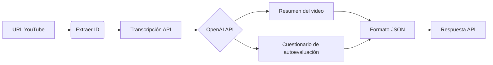

# YouTube AI Learning API

Una API desarrollada con FastAPI que utiliza inteligencia artificial para generar resúmenes y exámenes de autoevaluación a partir de videos de YouTube.
El proyecto originalmente fue creado para trabajar con la API de Vimeo, y los datos de transcripción eran almacenados en el backend (Odoo Framework).

## 🚀 Demo en vivo
[](https://youtube-ai-learning-api.onrender.com/docs#/)

*Nota: La demo pública utiliza mi token de OpenAI con límites de uso.*

## 🚀 Características

- **Extracción de transcripciones**: Obtiene automáticamente las transcripciones de videos de YouTube
- **Generación de resúmenes**: Crea resúmenes concisos del contenido audiovisual utilizando OpenAI
- **Exámenes de autoevaluación**: Genera preguntas y respuestas basadas en el contenido del video
- **API REST**: Endpoints documentados para integración con aplicaciones frontend
- **Interfaz interactiva**: Documentación automática con Swagger UI

## 🛠️ Tecnologías

- **FastAPI**: Framework web moderno y rápido para Python
- **OpenAI API**: Modelo GPT para generación de contenido
- **YouTube Transcript3 (RapidAPI)**: Para acceso a transcripciones de videos vía https://rapidapi.com/solid-api-solid-api-default/api/youtube-transcript3
- **uv**: Gestor de dependencias Python ultrarrápido
- **Pydantic**: Validación de datos y serialización

## 🔍 Flujo de procesamiento


## 📋 Requisitos previos

- Python 3.8+
- Token de API de OpenAI
- Token de API de YouTube Transcript3 (RapidAPI)
- uv instalado ([Guía de instalación](https://docs.astral.sh/uv/getting-started/installation/))

## 🔧 Instalación

1. **Clona el repositorio**
   ```bash
   git clone https://github.com/tu-usuario/youtube-ai-learning-api.git
   cd youtube-ai-learning-api
   ```

2. **Instala las dependencias con uv**
   ```bash
   uv sync
   ```

3. **Configura las variables de entorno**
   ```bash
   cp .env.example .env
   ```

4. **Edita el archivo .env y agrega tu token de OpenAI:**
   ```
   OPENAI_API_KEY=tu_token_aqui
   ```

5. **Ejecuta la aplicación**
   ```bash
   uv run uvicorn main:app --reload
   ```

La API estará disponible en http://localhost:8000

## 📖 Uso

**Documentación interactiva**  
Visita http://localhost:8000/docs para acceder a la documentación interactiva de Swagger UI.
